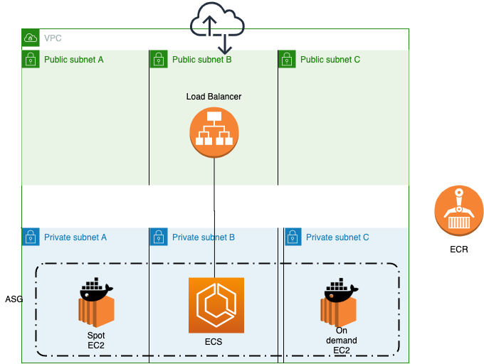

# AWS Auto Scaling Spot Fleet Cluster Quickstart
> Quickstart for running an example dockerised Python web server on AWS with an autoscaling group spot instances.

### Read The Blog Post ([github](./blog_post.md)/[medium](https://medium.com/@t3chflicks/aws-auto-scaling-spot-fleet-cluster-quickstart-with-cloudformation-6504a61f7aab)).

---

## Architecture 
> 

## Example Usage
> 

## Step By Step Deployment
1. Deploy VPC
    * `aws cloudformation create-stack --stack-name vpc --template-body file://aws/00_vpc.yml --capabilities CAPABILITY_NAMED_IAM`
    * tutorial for VPC can be found [here](https://medium.com/@t3chflicks/virtual-private-cloud-on-aws-quickstart-with-cloudformation-4583109b2433)
1. Deploy Load Balancer
    * `aws cloudformation create-stack --stack-name loadbalancer --template-body file://aws/01_load_balancer.yml --capabilities CAPABILITY_NAMED_IAM`
1. Deploy Cluster
    * `aws cloudformation create-stack --stack-name cluster --template-body file://aws/02_cluster.yml --capabilities CAPABILITY_NAMED_IAM`
    * Upload Docker image of Web Sever to ECR 
      1. `docker build -t your_repo_name .`
      1. `docker tag your_repo_name your_repo_name_tag`
      1. `docker push your_repo_name`
1. Deploy Machines
    * `aws cloudformation create-stack --stack-name machines --template-body file://aws/03_machines.yml --capabilities CAPABILITY_NAMED_IAM`
1. Deploy Service
    * Update template with your Docker image
    * `aws cloudformation create-stack --stack-name service --template-body file://aws/04_service.yml --capabilities CAPABILITY_NAMED_IAM`
